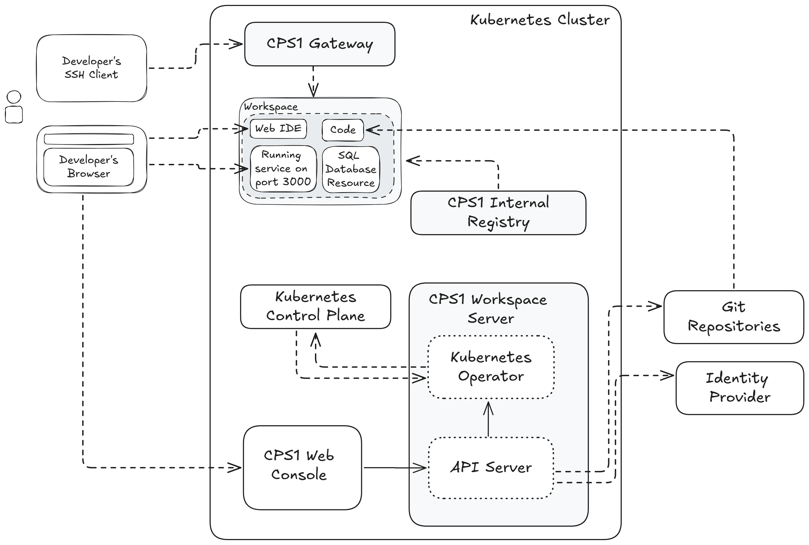

# Architecture Overview

CPS1 is deployed on your Kubernetes cluster to transparently handle all necessary operations that support its features.

!!! warning Dedicated Kubernetes cluster for CPS1

    We strongly recommend that CPS1 must be deployed on a Kubernetes cluster dedicated for development and doesn't have any production workloads.

    For more details on how to properly deploy CPS1, refer to the [Installing CPS1](installing.md) guide.

A CPS1 instance has three main components: the **Web Console**, the **Workspace Server**, and the **Gateway**.

The **Web Console** is used by developers and administrators for managing **Templates** and lauching development environment **Workspaces**.

The **Gateway** is responsible for providing SSH access to a Workspace.

The **Workspace Server** has two services. The first is the **API Server** that has the **Web Console** as its client. The second is an **Kubernetes Operator** that performs operations and listens for events on the cluster's Control Plane to manage the development environment **Workspaces** lifecycle.

CPS1 makes Kubernetes invisible, providing production-like environments and a seamless cloud-based developer experience. The **Kubernetes Operator** integrates into the cluster's Control Plane, continuously monitoring the actual state against the desired state and reconciling if configuration drift occurs.

The CPS1 **Kubernetes Operator** extends Kubernetes by combining [Custom Resource Definitions](https://kubernetes.io/docs/concepts/extend-kubernetes/api-extension/custom-resources/), [Pods](https://kubernetes.io/docs/concepts/workloads/pods/), [Deployments](https://kubernetes.io/docs/concepts/workloads/controllers/deployment/), [Services](https://kubernetes.io/docs/concepts/services-networking/service/), [ConfigMaps](https://kubernetes.io/docs/concepts/configuration/configmap/) and many other funcionalities to create development environment **Workspaces**.
