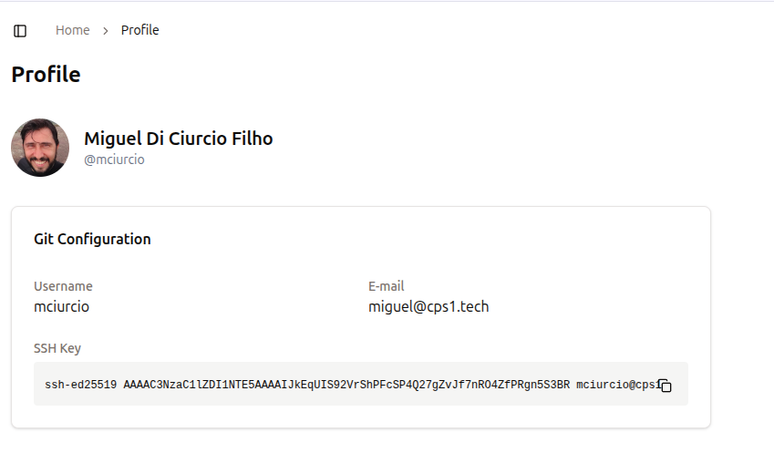

# Git Repository Integration

When a Workspace is provisioned, CPS1 may need to automatically clone and check out code from Git repositories specified in the Template. For this automation to succeed and Workspace provisioning not fail, CPS1 must have access to the configured repositories.

To simplify repository access, CPS1 generates a unique SSH key pair for each user.

!!! note "Add user's SSH key to your Git provider"

    To enable seamless integration, ensure that every CPS1 user adds their generated SSH public key to your organization's Git provider account.

To get your SSH public key:

1. Navigate to the bottom left corner of CPS1 web interface, where your username and profile picture are displayed.
2. Click your login name, then select `Profile`.
3. On the Profile page, you will see your public SSH key. Copy this key and add it to your git repository provider's account.

Once added, CPS1 will be able to access all repositories your user has permission to.

{ style="border: 1px solid #ccc; border-radius: 4px;" }
