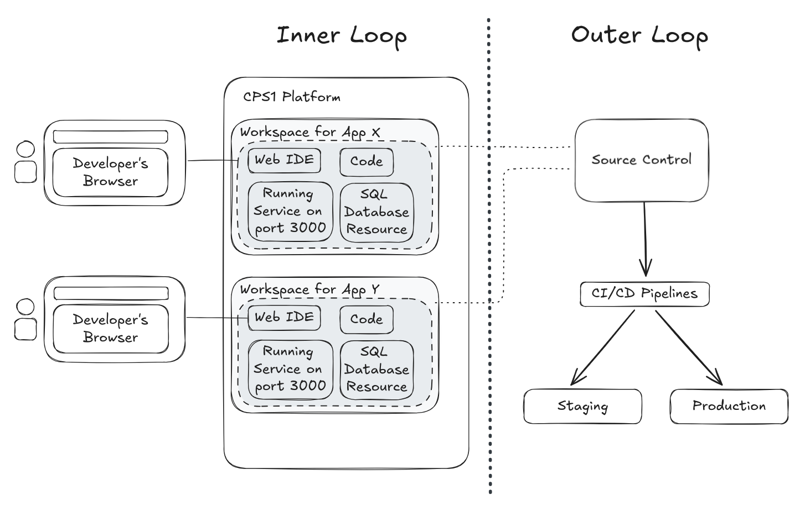

# How CPS1 fits into your workflow

To understand our vision for CPS1, you first need to know the concepts of inner and outer development loops. These terms describe two phases of the software development workflow.

CPS1 belongs on the code development stage of the workflow, empowering developers without disrupting existing CI/CD pipelines. It enhances the work developers do until code is pushed to source control, a process known as the **inner development loop**.

The **inner development loop** refers to a developer's cycle of coding, building, and testing changes. This process must provide rapid feedback until the code is ready for review, typically as a pull request (PR). This process occurs on CPS1 instead of the developer's computer within a local environment.

In CPS1, developers access a Web IDE, which serves as the entry point to their **Workspace**. A **Workspace** a cloud-based development environment where developers code, build, and test an **App**. Once complete, developers commit and push code to source control, typically triggering CI/CD pipelines.

The **outer development loop** begins after a developer pushes code to the repository. In this phase, changes are merged into the main branch, typically triggering a CI/CD pipeline to test and build the new code. This process produces a production-ready artifact for deployment.

What advantages does CPS1 bring:

- Provides a production-like environment with all necessary infrastructure, IDE, and tools for developers.
- Launch complex applications with a specific version of the code for end-to-end testing, including all services and resource dependencies.
- Develop any part of the application directly in the cloud and see changes in real time, reducing iteration time.
- Frees developers and platform teams from managing environment provisioning and resource dependencies.
- Eliminates the complexity of setting up local environments and resolves discrepancies between development and production.
