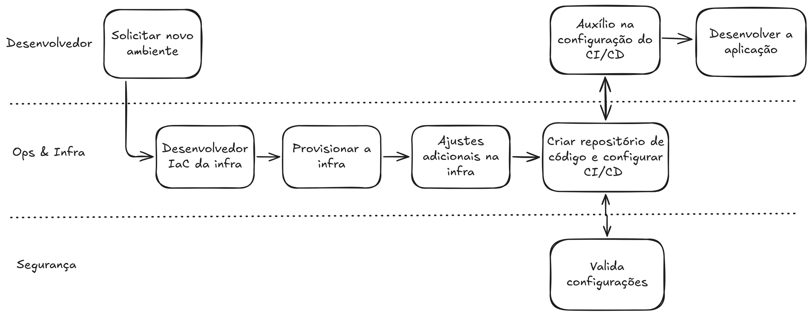
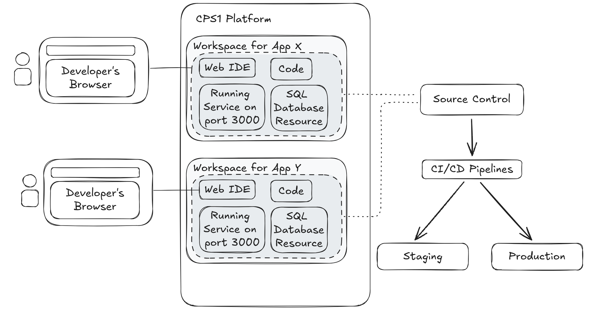
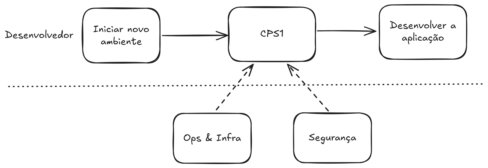

# O que é Cloud Programming Shell (CPS1)?

**Cloud Programming Shell (CPS1) provisiona ambientes de dev seguros e isolados para IA e desenvolvedores unificados a infraestrutura de serviços de nuvem.**

O CPS1 preenche a lacuna entre Platform Engineering e Developer Experience, unificando o provisionamento de infraestrutura e o desenvolvimento remoto em um único fluxo self-service.

## Fluxo sem CPS1

Em cenário muito comum nas empresas é o TicketOps. Diversas demandas dos times de produto precisam passar pela abertura e chamados com um time de DevOps/SRE.

{ style="border: 1px solid #ccc; border-radius: 4px;" }

## O Problema Geral da "Cola" em Platform Engineering

No software, "cola" (glue) é o código personalizado, scripts e transferências manuais usados para fazer com que diferentes ferramentas conversem entre si. Em Platform Engineering, colar resulta em três dores principais:

* Degradação de metadados: A informação criada em uma ferramenta (por exemplo, uma connection string de banco de dados no Terraform) torna-se "obsoleta" ou se perde no momento em que chega à segunda ferramenta (a IDE).
* O problema de configuração "N+1": Se você alterar uma porta em seu infra orchestrator, agora você tem uma tarefa "N+1": você deve encontrar e atualizar manualmente cada ambiente dependente. Se você tiver 50 desenvolvedores, são 50 pontos potenciais de falha.
* Pipelines frágeis: O código de "cola" raramente é unit-tested. Quando o Orchestrator atualiza sua API, a "cola" quebra e, de repente, ninguém consegue codar.

## Platform Orchestrator vs. Cloud Development Environment

Quando você "cola" um Platform Orchestrator a um Cloud Development Environment, você encontra o "Cross-Configuration Gap".

* **O Cenário**: Seu Orchestrator provisiona uma instância dinâmica de PostgreSQL para a feature branch de um desenvolvedor.
* **O Problema**: O Orchestrator atribui um dynamic internal DNS name.
* **A Ponte Manual**: O desenvolvedor agora tem que copiar e colar manualmente essa connection string em seu arquivo `.env` ou em suas configurações do VS Code dentro do CDE (ou mesmo localmente).

Outro cenário comum: como as ferramentas são separadas, os desenvolvedores frequentemente codificam secrets de forma fixa ou usam "test1234" apenas para ignorar o atrito da integração.

Neste modelo, o sonho do self-service morre porque o desenvolvedor ainda está preso "configurando" em vez de "codando".

## Como o CPS1 se encaixa no seu workflow

O CPS1 pertence ao estágio de desenvolvimento de código do workflow, capacitando os desenvolvedores sem interromper as pipelines de CI/CD existentes.

Ele aprimora o trabalho que os desenvolvedores fazem até que o código seja enviado para o source control, um processo conhecido como **inner development loop**.

No CPS1, os desenvolvedores acessam um **Workspace**, que serve como ponto de entrada para seu **Environment**. Um **Workspace** é um ambiente de desenvolvimento baseado em nuvem onde os desenvolvedores codam, buildam e testam o código da aplicação. Uma vez concluído, os desenvolvedores fazem o commit e o push do código para o source control, normalmente acionando as pipelines de CI/CD.

Quais vantagens o CPS1 traz:

- Fornece um ambiente semelhante à produção com toda a infraestrutura, IDE e ferramentas necessárias para os desenvolvedores.
- Lançar aplicações complexas com uma versão específica do código para testes end-to-end, incluindo todos os serviços e dependências de resources.
- Desenvolver qualquer parte da aplicação diretamente na nuvem e ver as mudanças em tempo real, reduzindo o tempo de iteração.
- Libera os desenvolvedores e as equipes de plataforma do gerenciamento de provisioning de ambientes e dependências de resources.
- Elimina a complexidade de configurar ambientes locais e resolve discrepâncias entre desenvolvimento e produção.

## Flux com CPS1

{ style="border: 1px solid #ccc; border-radius: 4px;" }

* **Migração para a Nuvem**: O desenvolvimento deve sair das máquinas locais para uma infraestrutura de nuvem automatizada, garantindo que o ambiente escale conforme o sistema cresce.
* **Ambiente Coeso**: Código e dependências de infraestrutura devem ser tratados como uma única unidade para eliminar problemas de integração ("cola").
* **Velocidade e Qualidade**: Essa unificação aumenta a velocidade de entrega e mantém o padrão de qualidade sem precisar aumentar a equipe.
* **Novo Paradigma**: Superar setups locais fragmentados ao unificar ambiente e infraestrutura em um único fluxo de trabalho mais resiliente e eficiente.

