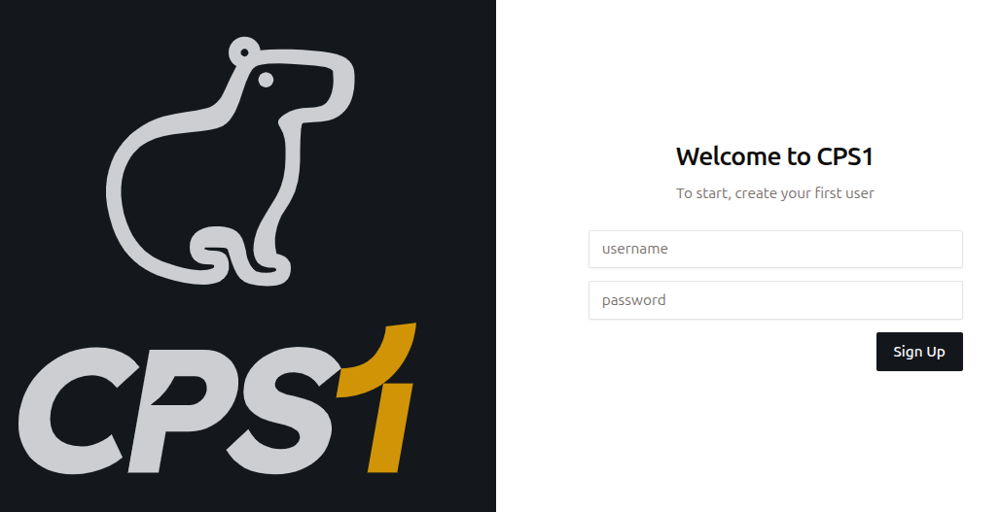
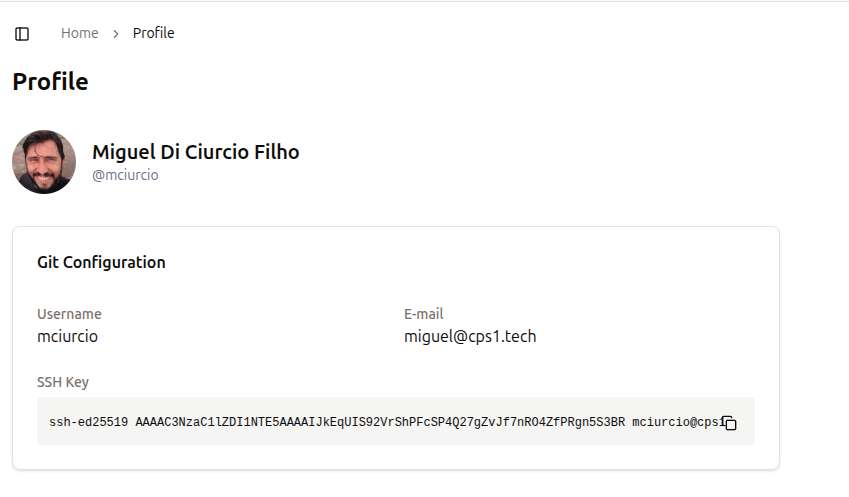

# Prática 1: Instalação CPS1

Bem-vindo! Neste tutorial, você instalará o CPS1 localmente e configurará o acesso ao GitHub.

## 1. Pré-requisitos

Certifique-se de que as seguintes ferramentas estejam instaladas:

- [Docker](https://docs.docker.com/get-docker/)
- [Kind](https://kind.sigs.k8s.io/docs/user/quick-start/)
- [Helm](https://helm.sh/docs/intro/install/)
- [kubectl](https://kubernetes.io/docs/tasks/tools/)

## 2. Executando o instalador

Execute o comando abaixo:
```
curl https://helm.cps1.tech/cps1-installer.sh | bash
```

Após a instalação terminar, você pode acessar o CPS1 em [http://cps1.localhost:3001](http://cps1.localhost:3001).

## 3. Fazendo login na sua instância do CPS1

Quando uma nova instalação do CPS1 é feita, não há usuários criados.

Assim que você acessar o CPS1 pela primeira vez, ele solicitará que você crie uma conta de usuário `Admin`.

Use login `admin` e senha `admin`.

{ style="border: 1px solid #ccc; border-radius: 4px;" }

## 4. Integração de Repositório do GitHub

Para obter sua chave pública SSH:

1. Navegue até o canto inferior esquerdo da interface web do CPS1, onde seu nome de usuário e foto de perfil são exibidos.
2. Clique no seu nome de login e selecione `Profile`.
3. Na página Profile, você verá sua chave SSH pública. Copie esta chave e adicione-a na sua conta do GitHub.
4. Acesse [https://github.com/settings/keys](https://github.com/settings/keys){:target="_blank"} para adicionar a chave.

Uma vez adicionada, o CPS1 poderá acessar todos os repositórios aos quais seu usuário tem permissão.

{ style="border: 1px solid #ccc; border-radius: 4px;" }
