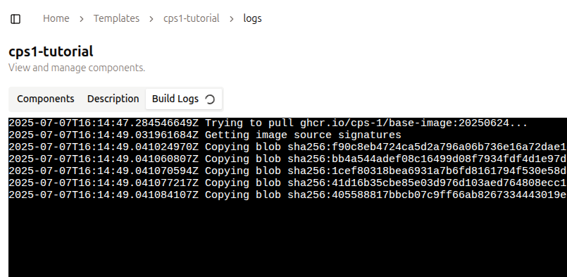
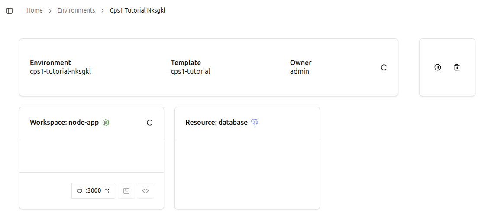

# Prática 2: Criando seu primeiro Environment

Neste tutorial você aprenderá como criar um novo **Template** contendo um **Workspace** e **Resources**, e finalmente provisionar um **Environment**!

## 1. Criando um Template

Todo Template tem um **Name** e algumas outras informações básicas, como **Description** e **Icon**.

Siga estes passos para criar um novo Template:

1. **Navegue até a página de Templates**  
   Na barra lateral esquerda, na seção `Environments`, clique em `Templates`.
2. **Visualize suas Templates existentes**  
   A página exibe todos os Templates atualmente disponíveis na sua instância do CPS1.
3. **Crie um novo Template**  
   Clique no botão `New Template` no canto superior direito da página.
4. **Preencha o formulário da Template**
   Forneça as seguintes informações:
    - **Name**: Um nome descritivo para o seu Template. Vamos usar `cps1-tutorial`.
    - **Description** (opcional): Adicione uma breve descrição para ajudar outros a entenderem o propósito do Template.
    - **Icon** (opcional): Adicione uma URL de ícone ou dados SVG para identificar visualmente o Template.
5. **Salve o Template**  
   Clique em `Create` e você será levado para o próximo passo para adicionar um **Resource** e **Workspace**.

## 2. Adicionando Resources à Template

**Resources** são dependências externas, como bancos de dados, caches e message brokers.

Siga estes passos para adicionar um Resource de banco de dados PostgreSQL à Template `cps1-tutorial`:

1. **Adicione um novo Resource**  
   Clique em `New Resource`.
2. **Selecione o Resource PostgreSQL**  
   Na lista de Resources, selecione `PostgreSQL`.
3. **Preencha o campo ID**  
    O **Resource ID** deve ser simples e curto. Vamos usar `database`.
4. **Crie o Resource**  
   Role até o final e clique em `Create`. Deixe todos os outros campos com seus valores padrão.

Siga estes passos para adicionar um Resource de cache Redis à Template `cps1-tutorial`:

1. **Adicione um novo Resource**  
   Clique em `New Resource`.
2. **Selecione o Resource Redis**   
   Na lista de Resources, selecione `Redis`.
3. **Preencha o campo ID**  
    O **Resource ID** deve ser simples e curto. Vamos usar `cache`.
4. **Crie o Resource**  
   Role até o final e clique em `Create`. Deixe todos os outros campos com seus valores padrão.

## 3. Adicionando um Workspace ao Template

Os desenvolvedores conectam sua IDE de preferência a um **Workspace** para escrever, executar, depurar e testar código. Além disso, muitas vezes é necessário expor portas, para que os desenvolvedores possam acessar uma aplicação em execução.

Siga estes passos para adicionar um **Workspace** ao Template `cps1-tutorial`:

1. **Adicione um novo Workspace**  
   Clique em `New Workspace`.
2. **Preencha o campo ID**  
    O **Workspace ID** deve ser simples e curto. Vamos usar `node-app`.
3. **Defina uma Base Image**  
    Durante o processo de build do **Workspace**, o CPS1 sobrepõe suas configurações personalizadas nesta imagem, permitindo ambientes consistentes e reproduzíveis. O CPS1 fornece uma base image que é compatível com muitos packages integrados. Você pode deixar como está.
4. **Code Repository**  
   URL Git para um repositório. Preencha com `git@github.com:cps-1/nodejs-sample-app.git`
5. **Packages**  
   Selecione as ferramentas e linguagens a serem instaladas. Selecione `Node.js` com a versão `v24`.
6. **Network Ports**  
   Especifique as portas para torná-las acessíveis de fora do Workspace. Insira `3000` e deixe configurado como `Internal`.
7. **Defina Environment Variables**  
   Adicione nomes de variáveis e seus valores; eles serão configurados no Workspace e o CPS1 é capaz de enviar dados de um Resource para um Workspace.
   ```
   DB_HOST -> ${resources.database.host}
   DB_USER -> ${resources.database.user}
   DB_PASSWORD -> ${resources.database.password}
   CACHE_URL -> ${resources.cache.host}
   ```
8. Clique em `Create` para iniciar o processo de build.  
9. **Processo de build da Workspace Image**  
   O CPS1 construirá uma container image para usar como ponto de partida para o novo Workspace. Você pode acompanhar o processo de build na aba `Build Logs`.
   { style="border: 1px solid #ccc; border-radius: 4px;" }
10. Quando o build terminar, prossiga para criar um **Environment**.

## 4. Lançar um novo Environment

No CPS1, um **Environment** é criado com base em um determinado **Template**, com muitas capacidades adicionais em comparação com a execução local no laptop de um desenvolvedor.

Um Environment opera inteiramente no seu cluster Kubernetes onde o CPS1 está implantado. O CPS1 gerencia tudo de forma transparente, eliminando a necessidade de gerenciamento manual do Kubernetes.

Siga estes passos para criar um novo Environment:

1. **Navegue até a página de Environments**  
   Vá para a página `Environments` na barra lateral esquerda, na seção `Environments`.
2. **Crie um novo Environment**  
   Clique no botão `New Environment` no canto superior direito da página.
3. **Escolha um Template**  
   Selecione o template `cps1-tutorial` no lado direito da página e clique no botão `Launch` no canto inferior direito.
4. **Provisionamento do Environment**  
   Você será redirecionado para a página de detalhes do Environment, que exibe o progresso do provisionamento.
   { style="border: 1px solid #ccc; border-radius: 4px;" }
   
Após alguns instantes, seu Environment estará pronto para uso.

## 5. Acessando o novo Environment

Para acessar o Workspace, você encontrará as operações de controle do workspace:

- **Open Web IDE**: Abre a Web IDE em uma nova aba no seu navegador.
- **Access with SSH**: Copia um comando SSH para o clipboard para acessar o Workspace.

Navegue até o canto superior direito da página, onde você encontrará as operações de controle do Environment:

- **Pause Environment**: Pausa todos os Workspaces e Resources, interrompendo todos os processos. Os dados são persistidos, portanto, esta é uma operação segura.
- **Destroy Environment**: Encerra todos os processos e exclui todos os dados.


