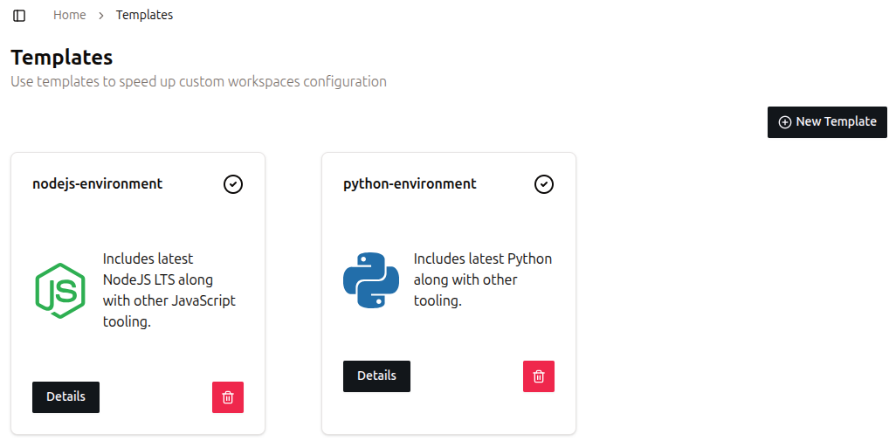
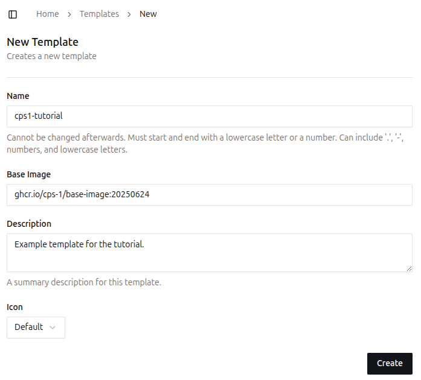

# Quickstart Guide

Welcome! In this tutorial, you’ll install CPS1 locally and learn how to create a new **Template** containing a **Workspace** and a **Resource**, and finally launch an **Environment**!

## 1. Prerequisites
Ensure the following tools are installed on your system:

- [Docker](https://docs.docker.com/get-docker/)
- [Kind](https://kind.sigs.k8s.io/docs/user/quick-start/)
- [Helm](https://helm.sh/docs/intro/install/)
- [kubectl](https://kubernetes.io/docs/tasks/tools/)

## 2. Running the installer

For proof-of-concept scenarios, we provide an installation script that installs CPS1 locally, without requiring a Kubernetes cluster.

Run the command bellow in your system:
```
curl https://helm.cps1.tech/cps1-installer.sh | bash
```

After the installation finishes, you can access CPS1 at [http://cps1.localhost:3001](http://cps1.localhost:3001).

For a production grade installation, follow the [Production Installation](installation/production-installation.md) guide.

## 3. Logging into your CPS1 instance

When a fresh installation is done, there are no users created.

Once you access CPS1 for the first time, it will prompted you to create an `Admin` user account.

Provide a username and password and you are ready to create your first **Template**!

## 4. Creating a Template in CPS1

Every Template starts with its **Name** and some other basic information, like Description and a Icon.

Follow these steps to create a new Template:

1. **Navigate to the Templates page**  
   In the left sidebar, under the `Environments` section, click on `Templates`.
2. **View your existing Templates**  
   The page displays all Templates currently available in your CPS1 instance, as shown below:  
   { style="border: 1px solid #ccc; border-radius: 4px;" }
3. **Create a new Template**  
   Click the `New Template` button at the top-right of the page.
4. **Fill out the Template form**  
   Provide the following information:
    - **Name**: A descriptive name for your Template. Let's use `cps1-tutorial`.
    - **Description** (optional): Add a short description to help others understand the Template’s purpose.
    - **Icon** (optional): Add an icon URL or SVG data to visually identify the Template.
   { style="border: 1px solid #ccc; border-radius: 4px;" }
5. **Save the Template**  
   Click on `Create` and you will be taken to the next step for adding a **Resource** and **Workspace**.

## 5. Adding a Resource to the Template

**Resources** are external dependencies, such as databases, caches, and message brokers.

Follow these steps to add a PostgreSQL database Resource to the `cps1-tutorial` Template:

1. **Add a new Resource**
   Click on `New Resource`.
   { style="border: 1px solid #ccc; border-radius: 4px;" }
2. **Select the PostgreSQL Resource**  
   On the Resource list, select `PostgreSQL`.
3. **Fill out the ID field**
    The **Resource ID** must be simple and short. Let's use `database`.
4. **Create the Resource**  
   Scroll down to the bottom and click `Create`. Leave all other fields at their default values.
   { style="border: 1px solid #ccc; border-radius: 4px;" }

## 6. Adding a Workspace to the Template

Developers connect their preferred IDE to a **Workspace** to write, run, debug, and test code. Also, it is often necessary to expose network ports, so developers can access a running application.

It is defined by three main attributes:

- **Code Repository**: Provides the source code to be cloned and executed in the Workspace.
- **Packages**: Install the necessary tools and runtimes into the final Template container image.
- **Network Ports**: Enable internal and external communication for the Service.

Follow these steps to add a **Workspace** to the `cps1-tutorial` Template:

1. **Add a new Workspace**
   Click on `New Workspace`.
   { style="border: 1px solid #ccc; border-radius: 4px;" }
2. **Fill out the ID field**
    The **Workspace ID** must be simple and short. Let's use `node-app`.
3. **Define a Base Image**
    During the **Workspace** build process, CPS1 layers your custom configurations on top of this image, enabling consistent and reproducible environments. CPS1 provides a base image that is compatible with many built-in packages. You can leave this as is.
4. **Code Repository**
   *(optional)*: Git URL to a repository. You can leave it empty. Note: CPS1 requires access to the repository for cloning it. Refer to [Git Repository Integration](git-repository-integration.md) for further instructions. 
5. **Packages**
   *(optional)*: Select the tools and languages to install. Select `Node.js` with version `v24`.
6. **Network Ports**
   *(optional)*: Specify ports to make accessible from outside the Workspace. Enter `3000`.
7. **Define Environment Variables**
   Add variable names and their values, they will be set on the Workspace. Also, CPS1 native orchestrator is able to output data from a Resource into a Workspace. The demonstration below shows how to perform this mapping.
   { style="border: 1px solid #ccc; border-radius: 4px;" }
8. Click `Create` to start the build process.
9. **Workspace Image build process**
   CPS1 will build a container image to use as a starting point for new Workspace. You can follow the build process on the `Build Logs` tab.
   { style="border: 1px solid #ccc; border-radius: 4px;" }
10. When the build finishes, move on to create an **Environmet**.

## 7. Launch a new Environment

In CPS1, an **Environment** is created based on a given **Template**, with many additional capabilities compared to running locally on a developer’s laptop.

An Environment operates entirely on your Kubernetes cluster where CPS1 is deployed. CPS1 manages everything transparently, removing the need for manual Kubernetes management.

Follow these steps to create a new Environment:

1. **Navigate to the Environments page**  
   Go to the `Environments` page in the left sidebar, under the `Environments` section.
2. **Create a new Environment**  
   Click the `New Environment` button at the top-right of the page.
3. **Choose a Template**  
   Select the `cps1-tutorial` template on the right side of the page and then click the `Launch` button at the bottom-right.
   { style="border: 1px solid #ccc; border-radius: 4px;" }
4. **Environment provisioning**  
   You will be redirected to the Environment detail page, which displays the provisioning progress.
   { style="border: 1px solid #ccc; border-radius: 4px;" }
   
After a few moments, your Environment will be ready to use.

The **Workspace** is accessible using the integrated Web IDE directly from a web browser or using an SSH connection.

**Ports** in the Workspace configured to expose network traffic will be accessible via a URL automatically generated by CPS1.

To access the Workspace, navigate to the left of the page, where you can find the workspace control operations:

- **Open Web IDE**: Opens the Web IDE in a new tab in your browser.
- **Access with SSH**: Copies an SSH command to the clipboard to access the Workspace.

Navigate to the top-right of the page, where you can find the Environment control operations:

- **Pause Environment**: Pauses all Workspaces and Resources, stopping all processes. Data is persisted, so this is a safe operation.
- **Destroy Environment**: Terminates all processes and deletes all data.

{ style="border: 1px solid #ccc; border-radius: 4px;" }

!!! warning "Workspace lifecycle"
    
    Make sure all your code is committed and pushed to the git repository before destroying a Workspace.
    
    You can disconnect and reconnect to an active Workspace without affecting its running processes.
   
    Additionally, you can stop and restart a Workspace without losing any changes you have made.

If you encounter any issues or have feedback, please open an issue in our repository: [https://github.com/cps-1/cps1](https://github.com/cps-1/cps1)

