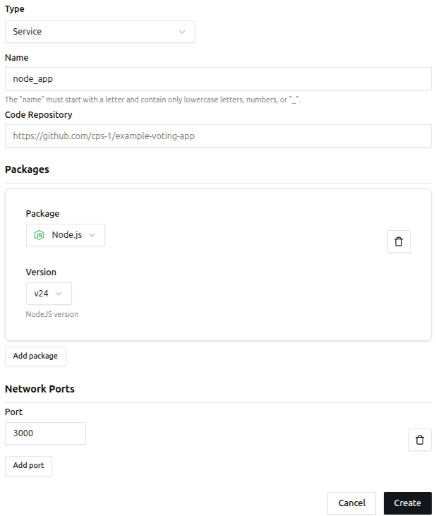
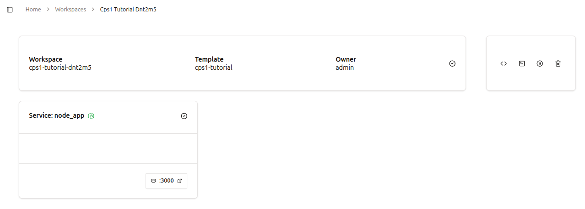

# Quickstart Guide

Welcome! In this tutorial, you’ll install CPS1 locally and learn how to create a new **Template** and provision a **Workspace**!

## 1. Prerequisites
Ensure the following tools are installed on your system:

- [Docker](https://docs.docker.com/get-docker/)
- [Kind](https://kind.sigs.k8s.io/docs/user/quick-start/)
- [Helm](https://helm.sh/docs/intro/install/)
- [kubectl](https://kubernetes.io/docs/tasks/tools/)

## 2. Running the installer

For proof-of-concept scenarios, we provide an installation script that installs CPS1 locally, without requiring a Kubernetes cluster.

Run the command bellow in your system:
```
curl https://helm.cps1.tech/cps1-installer.sh | bash
```

After the installation finishes, you can access CPS1 at [http://cps1.localhost:3001](http://cps1.localhost:3001).

For a production grade installation, follow the [Production Installation](installation/production-installation.md) guide.

## 3. Logging into your CPS1 instance

When a fresh installation is done, there are no users created.

Once you access CPS1 for the first time, it will prompted you to create an `Admin` user account.

Provide a username and password and you are ready to create your first **Template** and **Workspace**!

## 4. Creating a Template in CPS1

Every Template starts with a **base container image**. During the Template build process, CPS1 layers your custom configurations on top of this image, enabling consistent and reproducible environments.

Follow these steps to create a new Template:

1. **Navigate to the Templates page**  
   In the left sidebar, under the `Environments` section, click on `Templates`.
2. **View your existing Templates**  
   The page displays all Templates currently available in your CPS1 instance, as shown below:  
   { style="border: 1px solid #ccc; border-radius: 4px;" }
3. **Create a new Template**  
   Click the `New Template` button at the top-right of the page.
4. **Fill out the Template form**  
   Provide the following information:
    - **Name**: A descriptive name for your Template. Let's use `cps1-tutorial`.
    - **Base image**: CPS1 provides a base image that is compatible with many built-in packages. You can leave this as is.
    - **Description** (optional): Add a short description to help others understand the Template’s purpose.
    - **Icon** (optional): Select an icon to visually identify the Template.
   { style="border: 1px solid #ccc; border-radius: 4px;" }
5. **Save the Template**  
   Click on `Create` and you will be taken to the next step for adding **Components**.

## 5. Adding a Service Component to the Template

A **Component** is the smallest functional unit in a Template, representing a specific part of an application such as a backend service, frontend interface, or database.

Each **Component** reflects a distinct technology or service needed to assemble a complete development environment.

A **Service** is a Component that runs code, often exposing network ports for communication.

It is defined by three main attributes:

- **Code Repository**: Provides the source code to be cloned and executed in the Workspace.
- **Packages**: Install the necessary tools and runtimes into the final Template container image.
- **Network Ports**: Enable internal and external communication for the Service.

Follow these steps to add a **Service Component**:

1. **Add a new component**  
   Click on `New Component`.
   { style="border: 1px solid #ccc; border-radius: 4px;" }
2. **Select the Service component**  
   On the Components tab, select `Service`.
   { style="border: 1px solid #ccc; border-radius: 4px;" }
3. **Fill out the Service form**
    -  **Name**: A descriptive name for the Service. Let's use `node_app`.
    - **Code Repository** *(optional)*: Git URL to a repository. You can leave it empty. Note: CPS1 requires access to the repository for cloning it. Refer to [Git Repository Integration](git-repository-integration.md) for further instructions. 
    - **Packages** *(optional)*: Tools and languages that are installed on top of the Template base image. Select `Node.js` and then version `v24`.
    - **Network Ports** *(optional)*: Ports that will be made accessible from outside the Workspace. Let's use `3000`.
   { style="border: 1px solid #ccc; border-radius: 4px;" }
4. **Create the Service**  
   Click `Create` to start the build process.
5. **Template build process**  
   CPS1 will build a container image to use as a starting point for new Workspaces. You can follow the build process on the `Build Logs` tab.
   { style="border: 1px solid #ccc; border-radius: 4px;" }
6. When the build finishes, move on to create a **Workspace**.

## 6. Create a new Workspace

In CPS1, a **Workspace** is an ephemeral development environment created based on a given **Template**, with many additional capabilities compared to running locally on a developer’s laptop.

A Workspace operates entirely on your Kubernetes cluster where CPS1 is deployed. You don’t need to worry because CPS1 manages everything transparently, making Kubernetes operations invisible.

Follow these steps to create a new Workspace:

1. **Navigate to the Workspaces page**  
   Go to the `Workspaces` page in the left sidebar, under the `Environments` section.
2. **Create a new Workspace**  
   Click the `New Workspace` button at the top-right of the page.
3. **Choose a Template**  
   Click the `cps1-tutorial` template on the right side of the page and then click the `Launch` button at the bottom-right.
   { style="border: 1px solid #ccc; border-radius: 4px;" }
4. **Workspace provisioning**  
   You will be redirected to the Workspace detail page, which shows that your **Workspace** is being provisioned.
   { style="border: 1px solid #ccc; border-radius: 4px;" }
   
After a few moments, the Workspace will be ready to use.

The **Workspace** is accessible using the integrated Web IDE directly from a web browser or using an SSH connection.

**Services** configured in the Template that expose a network port will be accessible via a URL automatically generated by CPS1.

To access the Workspace, navigate to the top-right of the page, where you can find the workspace control operations:

- **Open Web IDE**: Opens the Web IDE in a new tab in your browser.
- **Access with SSH**: Copies an SSH command to the clipboard to access the Workspace.
- **Pause Workspace**: Pauses the Workspace, stopping all processes. Data is persisted, so this is a safe operation.
- **Destroy Workspace**: Finishes all processes on the Workspace and deletes all data.

{ style="border: 1px solid #ccc; border-radius: 4px;" }

!!! warning "Workspace lifecycle"
    
    Make sure all your code is committed and pushed to the git repository before destroying a Workspace.
    
    You can disconnect and reconnect to an active Workspace without affecting its running processes.
   
    Additionally, you can stop and restart a Workspace without losing any changes you have made.

If you encounter any issues or have feedback, please open an issue in our repository: [https://github.com/cps-1/cps1](https://github.com/cps-1/cps1)

<!--
## 4. Add a PostgreSQL Resource

    - External dependencies like databases, caches, or message brokers.
    - CPS1 supports popular resources (e.g., MongoDB, PostgreSQL) and integrates cloud infrastructure via Terraform.
    - Resources are isolated for development within **Workspaces**.

A **Resource** refers to an external dependency that an application relies on to function, such as databases, caches, message brokers, and others.

CPS1 provides a list of commonly used Resource Components, including MongoDB, MySQL, PostgreSQL, Redis, RabbitMQ, and more, with support for multiple versions. This list is regularly updated and maintained.

Resource Components managed by CPS1 are deployed in isolation for development and are integral to each Workspace.

CPS1 can also manage external infrastructure necessary for development at runtime, such as services from public cloud vendors, integrating them into the Workspace lifecycle using Terraform.
-->

