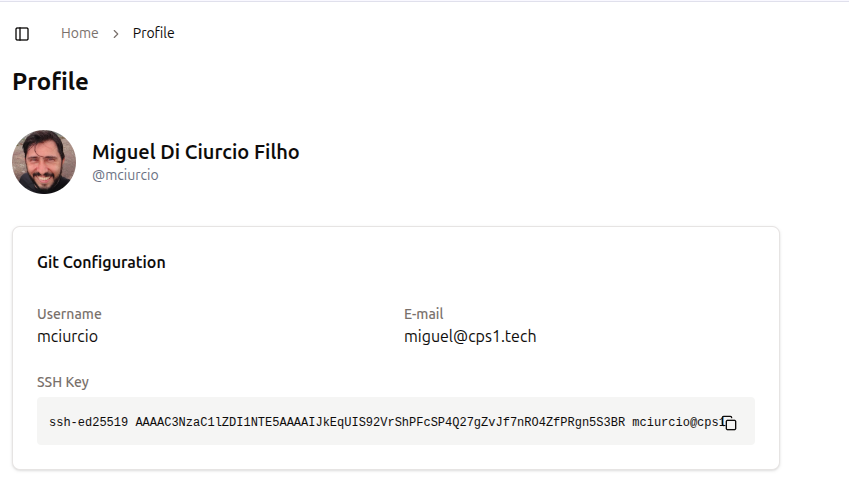

# User management

CPS1 supports two types of user accounts: `regular` and `admin`.

A regular user can manage templates and workspaces.

An admin user has full control over the CPS1 instance, including the ability to:

- Create and delete user accounts
- Manage licensing information
- Configure OAuth authentication

CPS1 supports authentication via GitHub and GitLab using OAuth, as well as its own local authentication system.

## Creating a local user account

To create an admin account:

1. Go to the `Users` page in the left sidebar, under the `Administration` section.
2. Click `New User`.
3. Fill in the required information.
4. If this is an Admin user, ensure the `Admin` checkbox is enabled.
5. Click `Create` to finish.

## Configuring OAuth

You can configure OAuth either through the CPS1 web interface or by setting values in the provided Helm charts.

Currently, only GitHub and GitLab are supported as OAuth providers.

After configuring OAuth, you can continue to create local users as needed.

To set up OAuth authentication:

1. Go to the `OAuth` page in the left sidebar, under the `Administration` section.
2. Choose your provider and select the corresponding tab (GitHub or GitLab).
3. For GitLab:
    - Navigate to your Group page, then go to `Settings` → `Applications`, and create a new application.
    - Set the `Redirect URI` to `https://cps1.example.com/api/auth/gitlab/authorized`, replacing `cps1.example.com` with your CPS1 instance domain. See the [Production Installation](/installation/production-installation.md) documentation for more details.
    - Enable the following scopes: `read_api`, `read_user`, `read_repository`, `write_repository`, and `openid`.
    - Save the application and copy the generated secret.
    - In the CPS1 GitLab configuration tab, enter the information provided by GitLab:
        * Application ID
        * Group ID
        * Hostname (default: gitlab.com)
        * Secret
    - Click `Update` to save your settings.
    - The GitLab login option should now appear on the CPS1 login page.
    - For more information, see the [GitLab OAuth Provider documentation](https://docs.gitlab.com/integration/oauth_provider/).
5. Click `Create` to finish.

## Accessing Git repositories

CPS1 automatically generates an SSH key pair for each user. You can find your public key on the User Profile page.

To access your public key:

1. Go to the bottom left corner of the CPS1 interface, where your username and profile picture are displayed.
2. Click your login name, then select `Profile`.
3. On the Profile page, you will see your public SSH key. Copy this key and add it to your GitLab or GitHub account.

Once added, CPS1 will be able to access all repositories your user has permission for. This is required to automate code checkout when CPS1 provisions workspaces.

{ style="border: 1px solid #ccc; border-radius: 4px;" }

